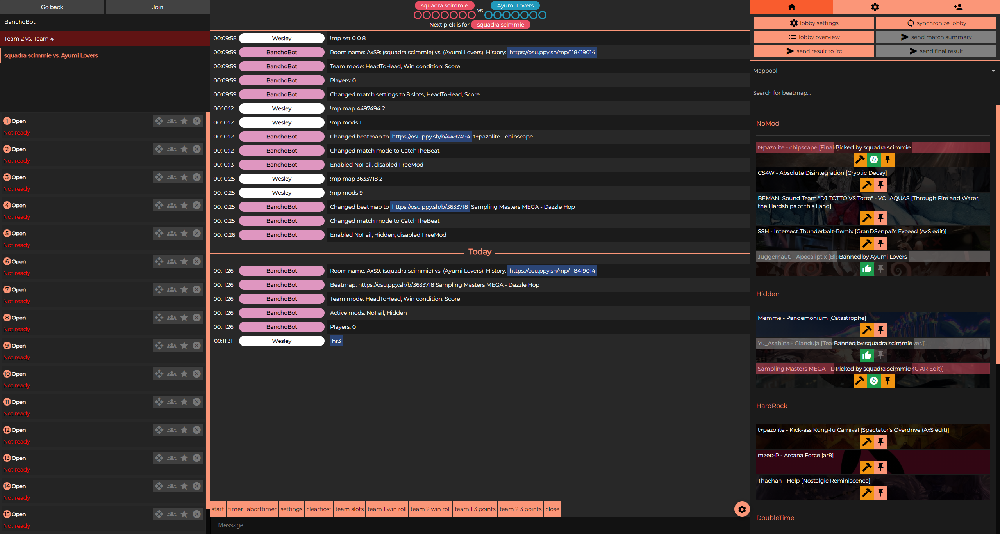
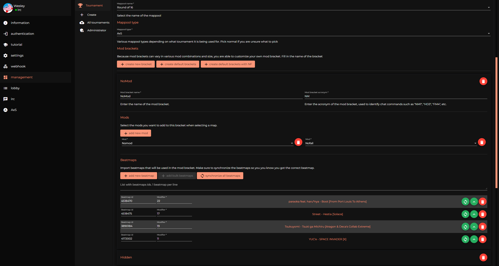

# wyReferee
**wyReferee** is a cross-platform referee client for your osu! tournament to help you manage your tournament matches with ease and automation.

	
	

## Features
- IRC: 
	- All your usual IRC functionality
	- Keeping track of match progression:
		- Match score being tracked
		- Which maps have been picked or banned
		- Which player or team picks next
	- A list of beatmaps (with buttons to pick them) for the current match stage
	- Clickable links in chat when a player types `NM1`, `DT3`, `FM4`, etc. 
	- List with all players for the current match with buttons to invite them
- Tournament management:
	- Manage your tournament, add referees, participants and mappools to essentially automate everything referee related
	- Configure webhooks to be sent to a specific channel when a certain event happens during the match, ie. match creation, beatmap picked, beatmap banned, match finished
	- Configure conditional messages that will be sent to the multiplayer lobby when a certain event is triggered during the match, ie. when sending the beatmap result or when a beatmap has been picked
		- These mssages are also fully customizeable with variables, example: 
			- `Score: {{ beatmapTeamOneScore }} - {{ beatmapTeamTwoScore }} | score difference : {{ scoreDifference }}` will get transformed to `Score: 989 323 - 222 541 | score difference : 766 782`
	- Configure mappools per stage: 
		- Every stage has their own mappool with mod brackets and beatmaps
		- Each mod bracket can have their own separate mods, which will be selected alongside the beatmap
- Custom score system support:
	- Ability to change up how score is calculated in realtime
	- Change mod score modifiers to something different (ie. Hardrock to 1.78x, Hidden to 2.23x, etc.)
	- Change how score is calculated alltogether, see ["calculations" header](https://osu.ppy.sh/community/forums/topics/1874028?n=1) for this tournament
	- _Disclaimer: custom score systems requires some development (usually isn't too much effort for most things), if you want to request a custom one make sure to do so ahead of time to see if it is feasible. Are you a developer yourself (or do you know someone who is willing to help), feel free to ask for help in the Discord server!_
- Full wyBin integration:
	- Import staff, participants, stages and mappools straight from your wyBin tournament, so you only have to enter it manually once
	- Submit match results (score, bans and stats) straight from wyReferee to wyBin

## Download
Head over to the [Releases](https://github.com/wesley-221/wyReferee/releases) page to download the install wizard.

## Contribute
You can find instructions on how to contribute code and bug reports [here](./CONTRIBUTING.md).
